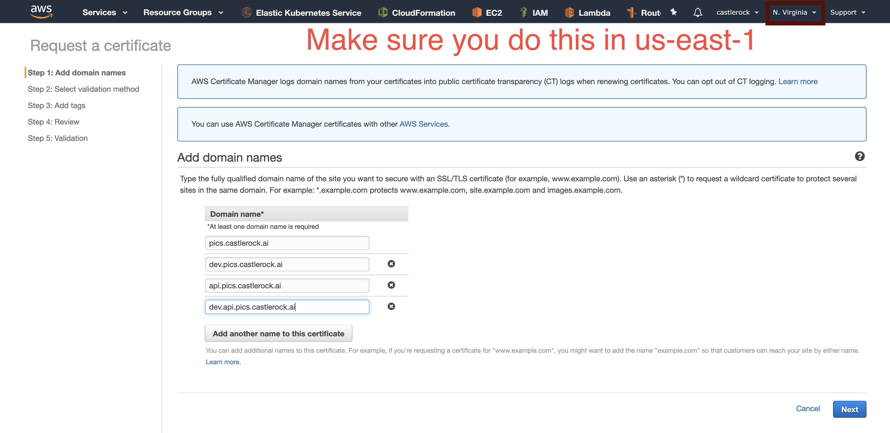

# Certificate Manager

We'll now open up the certificate service to create a TLS certificate for our app.  That way we can secure our connection. 

## Important: Do this in the us-east-1 region
You'll need to do this in the `us-east-1` region so it shows up for later.  Even if you do everything else in a different region, do this portion in the `us-east-1` region. 

## Request a Certificate

From the certificate service in AWS's huge menu of services, click 'Request a certificate'

Request a public certificate and add 4 domains to it: 

* `pics.castlerock.ai` - the main page.
* `www.pics.castlerock.ai` - alias if people still do www.  Do people do that still? 

 
* `dev.pics.castlerock.ai` - this is the staging page. 
* `api.pics.castlerock.ai` - this is the API we will create later. 
* `dev.api.pics.castlerock.ai` - this is the development API we will use.  

You'll of course want to change these to match your own domain names. 

To verify the certificates, we use DNS validation and automatically `Create record in Route 53` with the push of the button. 

Once done, we are now set to create a cloud front service. 