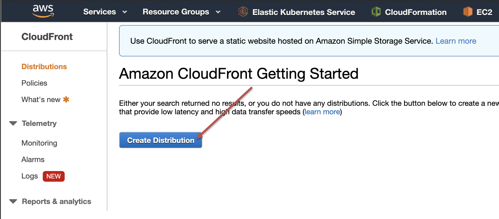
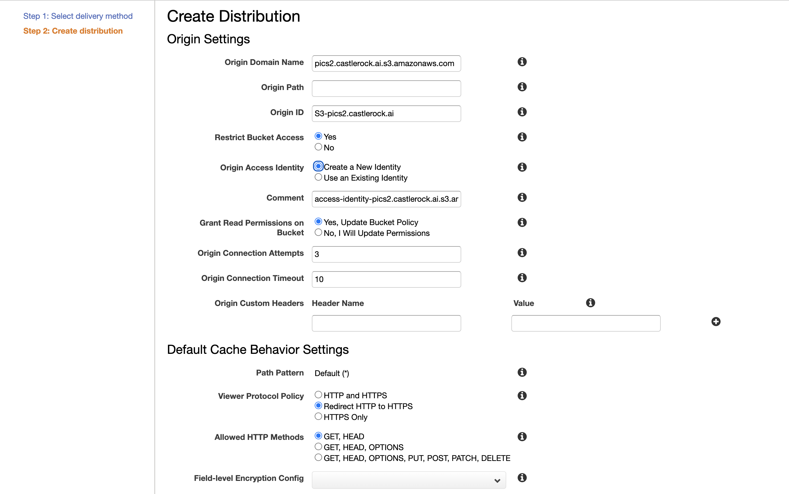
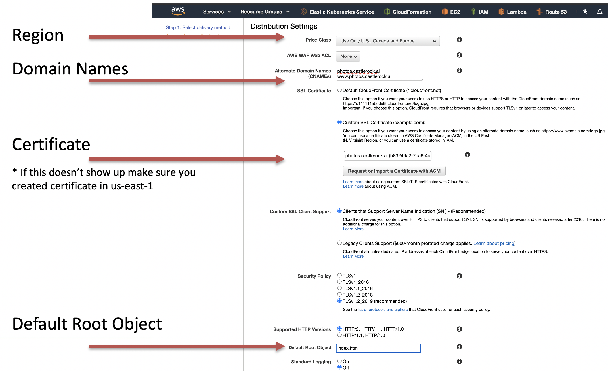

# Cloud Front

After creating our certificates, we need to create our front end CDN that will allow caching and terminate secure requests. 

CloudFront AWS free tier allows up to 50GB Transfer out, 2,000,000 HTTP/HTTPS requests.  Using this with the certificate we just created comes with no extra cost. 

We will create our distribution only for the US as for now, that is all we are operating in, but you can choose differently depending on your needs. 

## 01 Create New Distribution

Let's create a new distribution: 

Next select Web as your delivery method.  From there we get a nice big form to fill out. 

Important fields on this form: 

* Select the S3 delivery bucket.  (pics.castlerock.ai.s3.amazonaws.com for our example)
* Restrict bucket access.  
* Create a new origin access identity
* Update the bucket policy
* Redirect HTTP to HTTPS

The next fields also make use of our TLS certificate we generated previously. 

* Select the US region unless you are ready to go world wide. 
* Enter your domain names.  
* You should be able to select your own certificate that you created in the previous section. 
* Your default object will be the index.html you created already. 

Saving this will create your cloud front distribution. 
