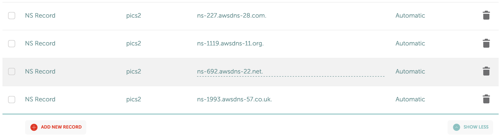
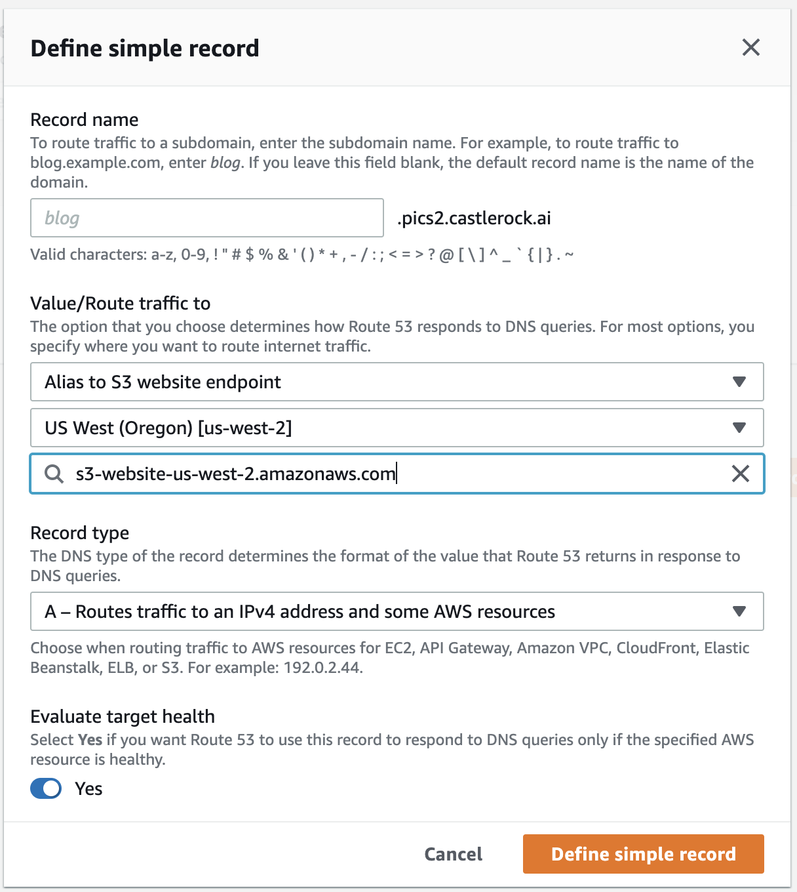
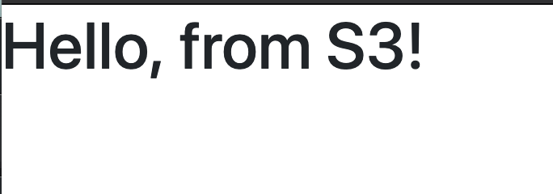

# Route 53

Route 53 is AWS's DNS service.  You can buy domain names from them or manage DNS from other domain providers. 

I usually buy my domains elsewhere, but AWS is probably a good place to buy.  Then I point the domains DNS to be managed by Route 53 where applicable. 

## 01 - Create Hosted Zone

Let's create a new hosted zone: 

```
aws route53 create-hosted-zone --name pics2.castlerock.ai \
 --caller-reference '2020-09-15:09:25'
```

The caller-reference is just a unique string to make sure the request doesn't happen twice.  We just put in the date.  

The results is our DNS info we need to put into our other DNS service: 

```
https://route53.amazonaws.com/2013-04-01/hostedzone/Z01374762ZFP1521DBRNE
CHANGEINFO	/change/C09383741NM5URADU2YFH	PENDING	2020-09-15T16:24:20.412Z
NAMESERVERS	ns-227.awsdns-28.com
NAMESERVERS	ns-1119.awsdns-11.org
NAMESERVERS	ns-692.awsdns-22.net
NAMESERVERS	ns-1993.awsdns-57.co.uk
HOSTEDZONE	2020-09-15:09:25	/hostedzone/Z01374762ZFP1521DBRNE	pics2.castlerock.ai.	2
CONFIG	False
```

## 02 - Update DNS Name Servers

Going to our DNS service provider (Namecheap.com shown here) we update our `NS` records with the records generated from the previous call: 



** NB: the image may say `pics2` or `pics`, or `photos`.  As I tested different things I used different subdomains.  Whichever you choose to use, make sure its just consistent and don't blindly copy and paste. 

## 03 - Create R53 to S3 Record

Let's now test what happens when we point our Route 53 record to the static site in S3. 




## 04 - Test your website

Now lets make sure it comes up. It might take up to 20 before it shows up. 



This is better in that we now have a real domain, hiding the Amazon domian.  But we still don't have security.  

Let's add that next.