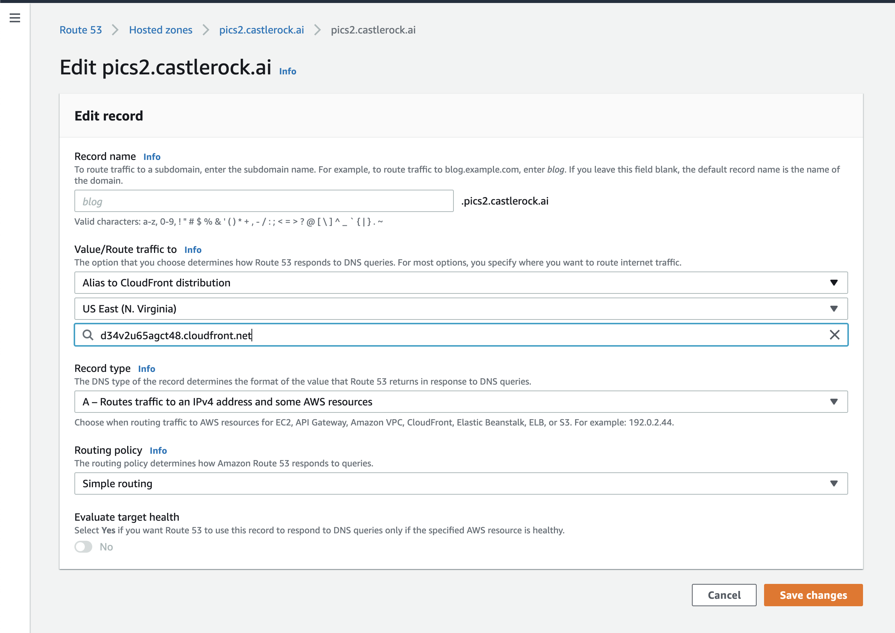
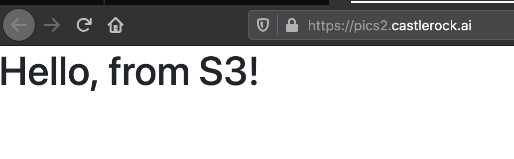

# Route 53 - Part 2

Now that we have a cloud front distribution we need to update our DNS record to point to this distribution. 

Click on Route 53 and edit the record `pics.castlerock.ai`.  Instead of an S3 origin, we are going to point to a Cloud Front Distribution. 

We should now be able to see our website securely!

