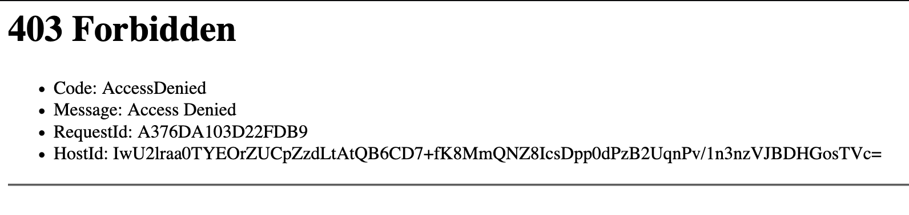

# Serving Web Pages on S3

In this lab we will create a web page that will be served on S3. 

## 01. Create `index.html`

Open your favorite text editor and type something up that can be saved as `index.html`.  If you know HTML, then you can go nuts.  Or, you can simply copy the sample [bootstrap](https://getbootstrap.com) template code below: 

```html
<!doctype html>
<html lang="en">
  <head>
    <!-- Required meta tags -->
    <meta charset="utf-8">
    <meta name="viewport" content="width=device-width, initial-scale=1, shrink-to-fit=no">

    <!-- Bootstrap CSS -->
    <link rel="stylesheet" href="https://stackpath.bootstrapcdn.com/bootstrap/4.5.2/css/bootstrap.min.css" integrity="sha384-JcKb8q3iqJ61gNV9KGb8thSsNjpSL0n8PARn9HuZOnIxN0hoP+VmmDGMN5t9UJ0Z" crossorigin="anonymous">

    <title>Hello, from S3</title>
  </head>
  <body>
    <h1>Hello, from S3!</h1>

    <!-- Optional JavaScript -->
    <!-- jQuery first, then Popper.js, then Bootstrap JS -->
    <script src="https://code.jquery.com/jquery-3.5.1.slim.min.js" integrity="sha384-DfXdz2htPH0lsSSs5nCTpuj/zy4C+OGpamoFVy38MVBnE+IbbVYUew+OrCXaRkfj" crossorigin="anonymous"></script>
    <script src="https://cdn.jsdelivr.net/npm/popper.js@1.16.1/dist/umd/popper.min.js" integrity="sha384-9/reFTGAW83EW2RDu2S0VKaIzap3H66lZH81PoYlFhbGU+6BZp6G7niu735Sk7lN" crossorigin="anonymous"></script>
    <script src="https://stackpath.bootstrapcdn.com/bootstrap/4.5.2/js/bootstrap.min.js" integrity="sha384-B4gt1jrGC7Jh4AgTPSdUtOBvfO8shuf57BaghqFfPlYxofvL8/KUEfYiJOMMV+rV" crossorigin="anonymous"></script>
  </body>
</html>
```

## 02. Create S3 Bucket

If you have a domain name registered, think of a subdomain you can do with this.  In our case, we have the domain name: [https://castlerock.ai](https://castlerock.ai).  We are going to create a new subdomain called [https://pics.castlerock.ai](https://pics.castlerock.ai).  This will be the site our users will log into to upload photos. 

Create a bucket that is the name of your complete domain name: 

```
aws s3 mb s3://pics.castlerock.ai
```

Now, upload `index.html` to this bucket: 

```
aws s3 cp index.html s3://pics.castlerock.ai/
```

## 03. Serve Web Page

Now that we have the `index.html` file in our bucket, let's serve it as a webpage. 

The command line is: 

```
aws s3 website s3://pics.castlerock.ai --index-document index.html
```
Since my `REGION` is set to us-west-2, then my website is now: 

[http://pics.castlerock.ai.s3-website-us-west-2.amazonaws.com](http://pics.castlerock.ai.s3-website-us-west-2.amazonaws.com)

Unfortunately, if we open this webpage we see the following error: 



This is because when we uploaded the file, we didn't change the permission to public readable. This can be changed by reuploading and changing the permission: 

```
aws s3 cp index.html s3://pics.castlerock.ai/ --acl public-read
```

Clicking the link now, shows our webpage: 


At this point, we've configured an S3 static web page in just a couple of commands!

At this point, we could point our domain name to this bucket and we would have a nice web page set up!  But the problem is, and this is a big no-no, is that our webpage is using HTTP.  If we are going to have users enter in their passwords and emails, we need to secure this site. 
In addition, since we want this to have low latency all over the world, we are going to front end it with Cloud Front. This will allow us to serve it securely and faster.

