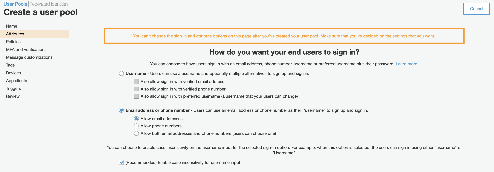
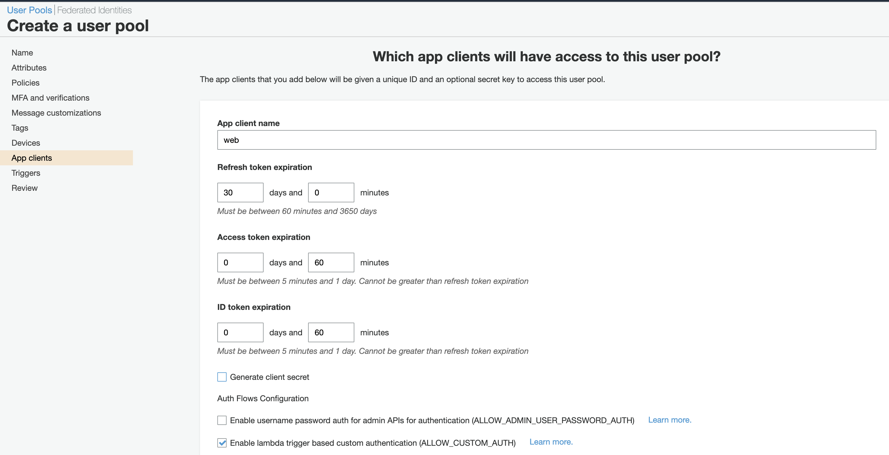
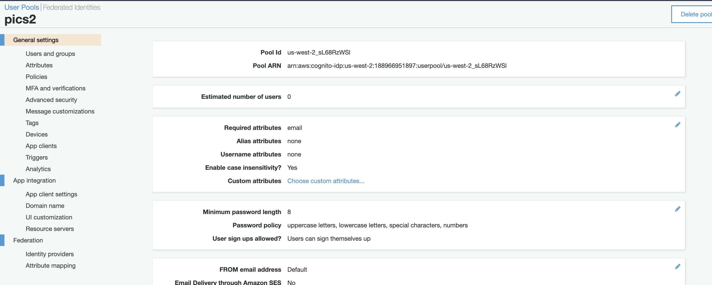
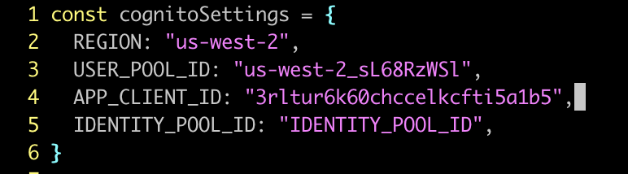
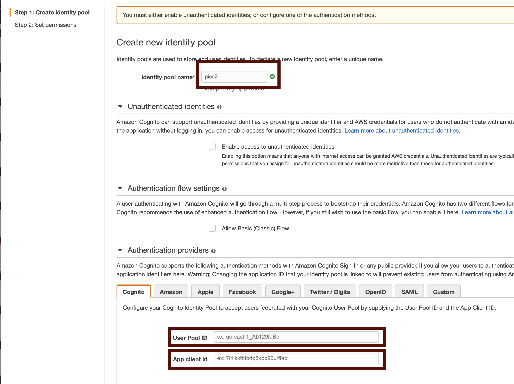
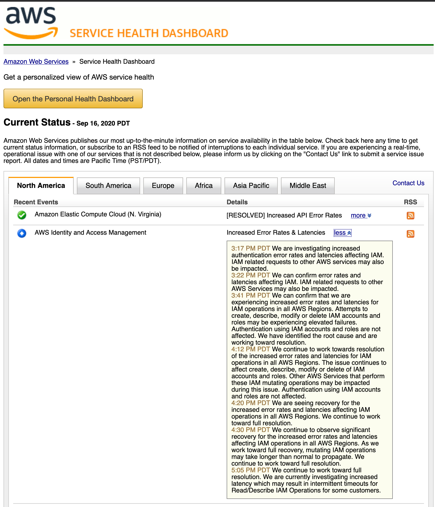
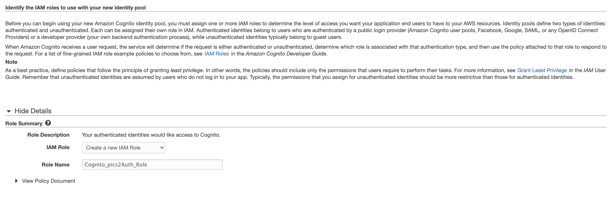
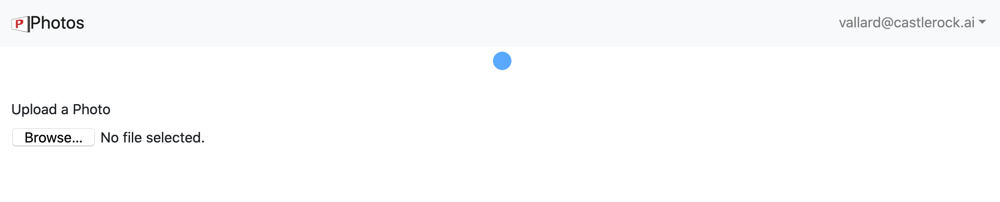

# Cognito

[Cognito is AWS's simple sign up, sign in, and access control micro service](https://aws.amazon.com/cognito/).  It allows you to easily add Facebook / Google sign in as well as other federated identities.  For our purpose, we'll just use the normal email and password features of the service. 

Once we have this, we can add it into our React Application and let our users sign in. 

## 01 Create User Pool

Open [Cognito](https://us-west-2.console.aws.amazon.com/cognito/users/) and create a new user pool. You can call it after the name of your app, like "photos" or "pics". 

Once selected review the defaults and we'll make a few changes. 

### Attributes

We will make the email the default login since our application is set up to work this way: 



### App Clients

Create an App Client for this Cognito User Pool.  You can call it `Web`.  Be sure to uncheck 'Generate Client Secret'. 



Save the changes and the new pool will be created.  

### Fill in `config.js` values with your pool

Click on the new pool you created if you are not already there.  click on general settings and note down the pool ID



This should be something like `us-west-2_sL68RzWSl`.  Make note of it. 

Next look at the `App Integration` section.  Look for the App Client ID


It should look something like `3rltur6k60chccelkcfti5a1b5` but with other random string characters. 


Opening up the React code, our `src/config.js` we will add these values in:

 

## 02 Create Identity Pool
Identity pools tie to user pools.  They allow us to authenticate through other services like Facebook / Google, Amazon, Apple, Twitter, or simple OpenID, etc. 

We will create a basic one.  Note the User Pool ID and App client ID you used in the previous section you will place in this section as well. 



We will then create a new IAM identity.  At the time I was writing this IAM went down. 



This is one of the drawbacks of relying on a cloud provider, as this is out of our hands to fix.  On the other hand, you will have problems if you do your own identities as well. 


Let Cognito create a new IAM role for you.  We will modify it later, so take note of the name. 




Enter the Identity pool id into the app in `config.js` as well: 

```
...
IDENTITY_POOL_ID: us-west-2:cb797dfa-8f0c-4c91-8497-4fa6e10411a4
...
```

## 03 Sign in

At this point you should be able to sign in to the web application on localhost!  You'll need to sign up with a real email address so you actually get the confirmation code that is sent.  Then you can log in.  When you log in you'll see some errors, but we will fix those as we add more microservices on the back end. 




 

 


