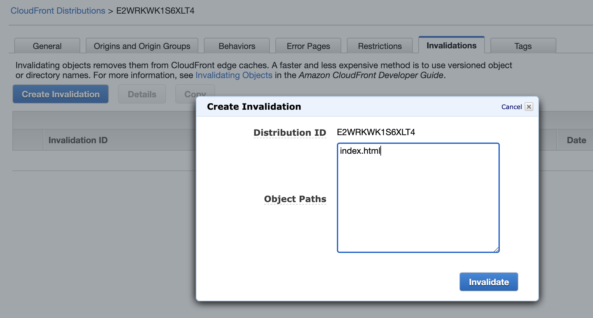

# Makefiles

If we have a CI/CD system to update our tooling, a good idea is to create a Makefile that makes pushing easy.  You could create a script and there are other ways to do this, but Makefile is tried and true.  You just type `make` and it pushes the commands. 

## 01 Edit Makefile

In the [./front-end](./front-end) directory there exists a [Makefile](./front-end/Makefile).  You can just modify the S3 bucket to match your bucket. 

```
.PHONY: all build push

all: build push

build:
  yarn run build

push:
  # replace s3://photos.castlerock.ai with the name of your s3 bucket.
  aws s3 cp build s3://pics.castlerock.ai --recursive --acl public-read
```

This is a pretty simple Makefile.  It will build the contents of the webpage and then push it up to the S3 bucket where we have our simple S3 site we created in [Part 2](../PART02).  

Once edited, on Linux and MacOS you can type: 

```
make
```


## 02 Invalidate CloudFront Distribution

Once we update the changes we can wait the 8 hours for cloudfront to sync, or we can invalidate everything now.  That way, within 5-10 minutes we see the updates instead of 8 hours. 

Navigate to Cloud Front, click on your distribution and select Create Invalidation.  From there, just put in the `index.html` and create the invalidation.  Make sure your files uploaded to S3 first as you expected. 



Invalidating can be expensive.  There are other methods that may be better for your organization described [here](https://docs.aws.amazon.com/AmazonCloudFront/latest/DeveloperGuide/Invalidation.html).