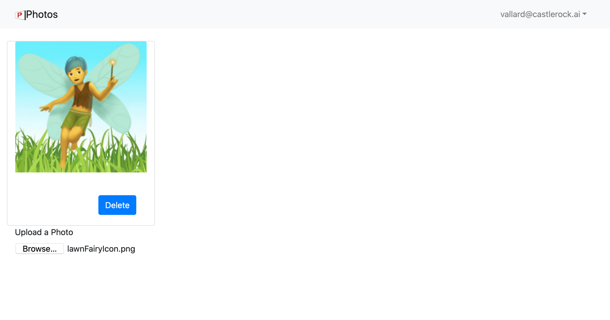

# Connecting Front End to Back End

Now that our backend is deployed we need to connect to our front end!

## 01 Update Front End `config.js`

Going back to our front end code, update the `src/config.js` with the values of our API and the resources we recently created. 

### apiGateway

* `REGION` - Change or leave as `us-west-2` where ever you are deploying your API. 
* `URL` - Change to the custom domain name you created.  There is a `dev` and a `prod` so fill in accordingly, e.g:

__dev:__

```json
 apiGateway: {
    REGION: "us-west-2",
    URL: "dev.api.pics2.castlerock.ai",
  }, 
``` 

__prod:__

```json
apiGateway: {
    REGION: "us-west-2",
    URL: "api.pics2.castlerock.ai",
  },
```

### s3 Bucket settings

These are the photo buckets you created. 

__dev:__

```json
 apiGateway: {
    REGION: "us-west-2",
    URL: "https://dev.api.pics2.castlerock.ai",
  }, 
``` 

__prod:__

```json
apiGateway: {
    REGION: "us-west-2",
    URL: "https://api.pics2.castlerock.ai",
  },
```

## 02 Test front end

If code is still running in the browser at [http://localhost:3000](http://localhost:300) it should refresh automatically when you update the `config.js` file.  You will find that it still doesn't work. The console will show you an error about not being allowed to connect (403 error code). 

The reason for this is that your Cognito resource hasn't been given permissions to  connect to the API gateway.  Let's fix that.

## 03 Update Cognito IAM

In [IAM](https://console.aws.amazon.com/iam/home#/home), navigate to Policies. First, we'll figure out our API Gateway resource IDs. These are in the actual API gateway when you click on them. 

You can also see these with: 

```
aws apigateway get-rest-apis
```

The output will look like: 

```
$ aws apigateway get-rest-apis
ITEMS	HEADER	1600367953	27ieco0k2d	dev-pics2
TYPES	EDGE
TAGS	dev
ITEMS	HEADER	1600368095	harwchm2q8	prod-pics2
TYPES	EDGE
TAGS	prod
```

The above `27ieco0k2d` and `harwchm2q8` are the ids we need. We will put a new statement in our policy for this API: 

```
 {
     "Effect": "Allow",
     "Action": "execute-api:Invoke",
     "Resource": [
          "arn:aws:execute-api:us-west-2:*:27ieco0k2d/*",
          "arn:aws:execute-api:us-west-2:*:harwchm2q8/*"
     ]
  }
```

We can now access the APIs and this time we don't get any errors!

There is still a problem, however. We can't upload PHotos.  The reason for this is that our API tries to upload to S3 directly, but we haven't given access to our buckets.  Let's add another IAM policy statement for our two dev/prod buckets: 

```
{
	"Effect": "Allow",
   "Action": "s3:*",
   "Resource": [
      "arn:aws:s3:::crpics2app/*",
      "arn:aws:s3:::crpics2app-dev/*"
   ]
}
```

We now should have the capability to upload images!

