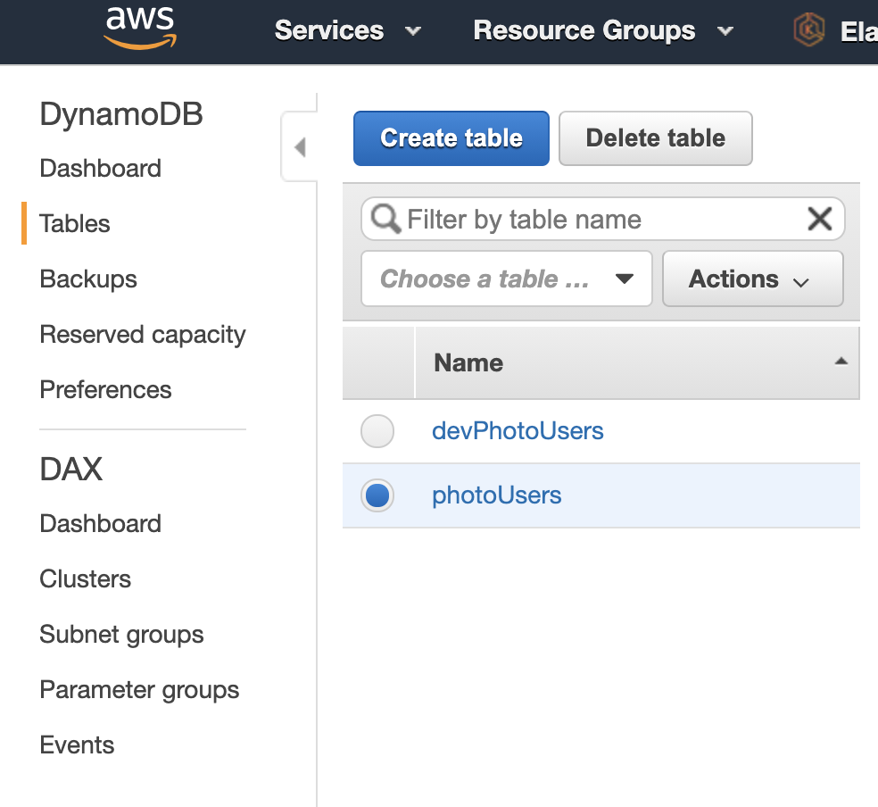
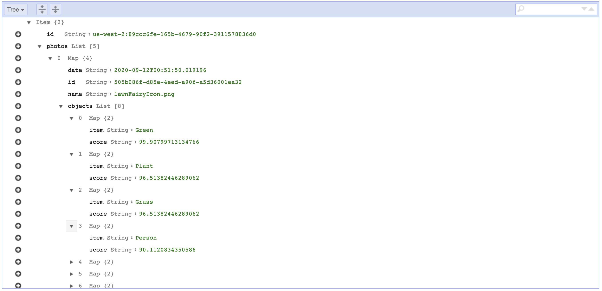

# DynamoDB

DynamoDB is AWS's NoSQL Database.  We can use it in our application to store photo metadata for each user. 

It's a good idea to create a test database and a production database. 

## 01 Create DynamoDB Tables

We can use Terraform to quickly create these 

```
cd ./PART04
terraform init
terraform plan
terraform apply
```

This will create two DynamoDB tables. 



## 02 Structure

Our structure of the table is pretty simple.  Basically we just have an ID (which is all you can see now) that is the primary key.  This ID will correspond to the user who signs up for our application.  Each user will have one spot in the table. 

The final structure, will look as follows: 



Here we see the following attributes of each reacord: 

* `id` The Primary key is the user ID that will be passed along. 
* `photos` The list of photo objects
	* `photo Object` This object has several attributes:
		* `id` Given to identify and delete the photo.
		* `name` The name of the photo stored in S3
		* `date` The date the item was created. 
		* `Objects` The list of objects detected in the photo. 
			* `Obect object` This is simply has two attributes:
				* `item` The object detected
				* `score` The amount of certainty that this object was found in the photo. 

				
These details will be added to the application after we've put all the pieces together.  But its good to know what is in it. 