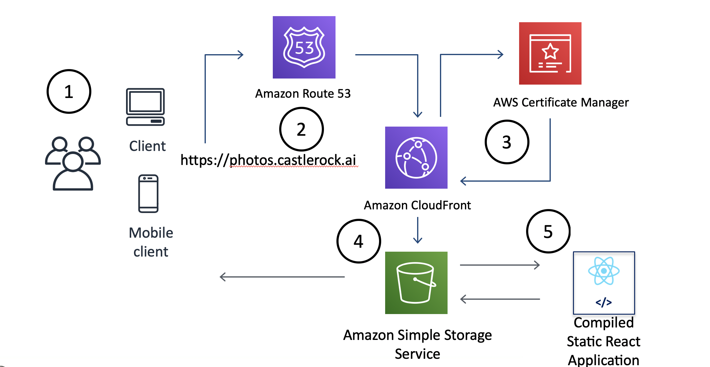
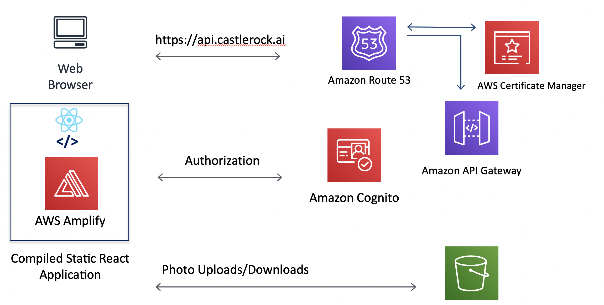
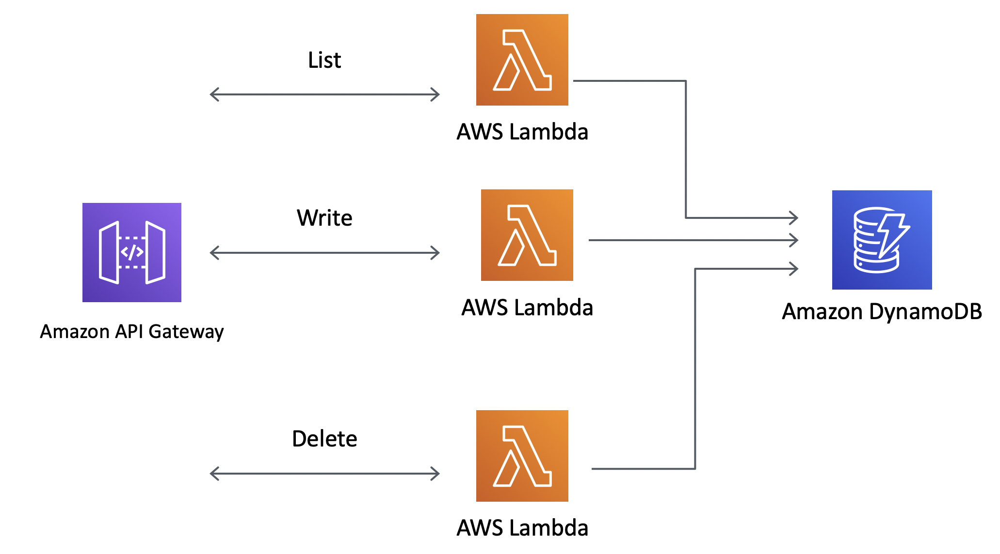
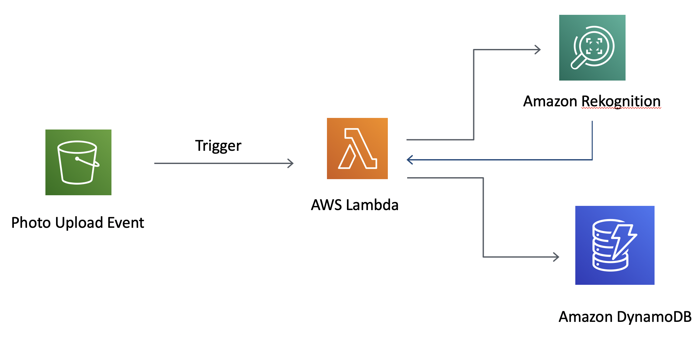

# MicroServices On AWS
Course Materials for Microservices on AWS O'Reilly Class That I teach. 

Join me [Monday, Sept 21st, 2020!](https://learning.oreilly.com/live-training/courses/microservices-on-aws/0636920403982/)

## Introduction 

This course serves as an introduction to running various services on AWS.  We show how these "microservices" can be stitched together to make a working application. Going through this course will give you an idea of what a "Full Stack" developer does.  You will be configuring services and writing code.  

Our application is a simple photo album complete with object recognition. 

 

Check out the [Tech Stack](./TECH.md) to see the technologies that will be used through this course. 

 

## Architecture

Our architecture looks as follows:

### Front End Services

We use s3 static hosting with cloudfront, S3, and certificates. 

### Client APIs

When the browser downloads the application, it calls three different APIs: Cognito, S3, and our API Gateway. 

### Backend System

We use the [serverless](https://serverless.com) project to create our API Gateway and Lambdas.  We also use DynamoDB to store metadata.

### Object Recognition 

Once images are uploaded, we can do object detection on them to find things inside of them. AI!

## Contents

### Part 1 - Set up

* [AWS Account](./PART01/SETUP.md)
* [AWS CLI](./PART01/SETUP.md#AWS-CLI)
* [Clone this repo](./PART01/SETUP.md#Git-Clone)

### Part 2 - WebSite Up

* [Serving on S3](./PART02/S3.md)
* [Route 53 Domain](./PART02/Route53.md)
* [Certificate Manager](./PART02/CertManager.md)
* [Configure Cloud Front](./PART02/CloudFront.md)
* [Update Route 53](./PART02/Route53Part2.md)

### Part 3 - Front End Development

* [Develop Our React Application](./PART03/REACT1.md) 
* [Cognito Setup](./PART03/Cognito.md)
* [Makefiles](./PART03/Make.md)

### Part 4 - Serverless Backend

* [DynamoDB](./PART04/DynamoDB.md)
* [Serverless](./PART04/Serverless.md)
* [Front End to Backend](./PART04/Connect.md)

### Part 5 - Putting it all together

* [Amazon Rekognition](./PART05/Rek.md)
* [Summary](./PART05/TheEnd.md)